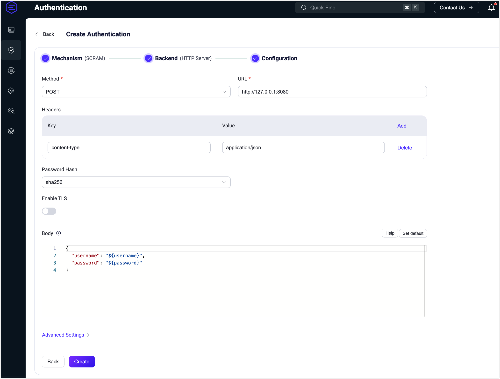

# REST API-Based MQTT 5.0 Enhanced Authentication

EMQX supports MQTT 5.0 enhanced authentication using REST API, implementing the [Salted Challenge Response Authentication Mechanism (SCRAM)](https://en.wikipedia.org/wiki/Salted_Challenge_Response_Authentication_Mechanism). The SCRAM authenticator utilizes an external web resource to retrieve the necessary authentication data in this implementation. When enabled, and a client initiates a connection request with SCRAM, EMQX uses the provided username to construct an HTTP request to the external service, obtaining the authentication data required for the authentication process.

While SCRAM is inherently a lightweight and simple authentication mechanism, this implementation enhances its functionality by integrating with an external REST API. This allows EMQX to securely and efficiently retrieve authentication data from various external systems, supporting more complex authentication scenarios.

::: tip Prerequisites

- Familiarity with [basic EMQX authentication concepts](./authn.md).
- SCRAM authenticator is only supported for MQTT 5.0 connections.
- This authenticator is not an implementation of the RFC 7804: [Salted Challenge Response HTTP Authentication Mechanism](https://datatracker.ietf.org/doc/html/rfc7804). 

:::

## HTTP Request and Response

The authentication process is similar to an HTTP API call. EMQX acts as the client, constructing and sending an HTTP request to an external HTTP service. The service responds with the required authentication data corresponding to the `username`.

### Response Format Requirements

To ensure successful authentication, the HTTP response must adhere to the following criteria:

- **Content-Type**: The response must be encoded as `application/json`.
- **Authentication Data**: Must include `stored_key`, `server_key`, and `salt`, all encoded in hexadecimal.
- **Superuser Indicator**: Use the `is_superuser` field, with possible values `true` or `false`.
- **Client Attributes**: Optionally, you can specify [client attributes](../../client-attributes/client-attributes.md) using the `client_attrs` field. Both keys and values must be strings.
- **Access Control List (ACL)**: Optionally include an `acl` field to define the client's permissions. Refer to the [Access Control List](./jwt.md#access-control-list-optional) for more details.
- **Expiration Time**: Optionally, you can set the `expire_at` field to specify when the client's authentication expires, after which the client must disconnect and re-authenticate. The value should be a Unix timestamp in seconds.
- **HTTP Status Code**: The HTTP response should return a `200 OK` status code. Any `4xx` or `5xx` status codes will be interpreted as `ignore`, and the authentication chain will proceed without this authenticator.

### Example HTTP Response

The following example illustrates the expected structure and content of the HTTP response:

```json
HTTP/1.1 200 OK
Headers: Content-Type: application/json
...
Body:
{
    "stored_key": "008F5E0CC6316BB172F511E93E4756EEA876B5B5125F1CD2FD69A2C30F9A0D73",
    "server_key": "81466E185EC642AFAE1EFA75953735D6C0934D099149AAAB601D59F8F8162580",
    "salt": "6633653634383437393466356532333165656435346432393464366165393137"
    "is_superuser": true, // options: true | false, default value: false
    "client_attrs": { // optional 
        "role": "admin",
        "sn": "10c61f1a1f47"
    }
    "expire_at": 1654254601, // optional 
    "acl": // optional 
    [
        {
            "permission": "allow",
            "action": "subscribe",
            "topic": "eq t/1/#",
            "qos": [1]
        },
        {
            "permission": "deny",
            "action": "all",
            "topic": "t/3"
        }
    ]
}
```

## Configure Authenticator with Dashboard

You can configure the SCRAM authenticator through the EMQX Dashboard.

1. Login to the EMQX Dashboard.

2. In the left navigation menu, click **Access Control** -> **Authentication** to open the **Authentication** page.

3. Click **Create** in the top right corner.

4. Select **SCRAM** as the **Mechanism** and **HTTP Server** as the **Backend**. By clicking **Next**, you will enter the **Configuration** step page, as shown below.

   

5. Configure the following settings:

   - **HTTP Configuration**:

     - **Method**: Select the HTTP request method (`GET` or `POST`). 

       ::: tip

       The `POST` method is recommended to avoid exposing sensitive information, such as passwords, in server logs. For untrusted environments, use HTTPS. 

       :::

     - **URL**: Enter the URL of the HTTP service.

     - **Headers** (optional): Specify any additional HTTP request headers.

   - **Authentication Configuration**:

     - **Password Hash**: Select the password hash algorithm (`sha256` or `sha512`).
     - **Enable TLS**: Enable TLS by toggling the switch. For more details on enabling TLS, see [TLS for External Resource Access](../../network/overview.md#tls-for-external-resource-access).
     - **Body**: Define the request template. For `POST` requests, it’s sent as JSON in the request body; for `GET` requests, it’s encoded as a Query String in the URL. Use [placeholders](./authn.md#authentication-placeholders) to map keys and values.

   - **Advanced Settings**:

     - **Connection Pool size** (optional): Set the number (integer value) of concurrent connections from an EMQX node to the HTTP server. Default: `8`.
     - **Connect Timeout** (optional): Specify the waiting period before EMQX assumes the connection is timed out. Supported units: `milliseconds`, `second`, `minute`, `hour`.
     - **HTTP Pipelining** (optional): Enter a positive integer to specify the maximum number of HTTP requests that can be sent without waiting for a response. Default: `100`.
     - **Request Timeout** (optional): Specify the waiting period before EMQX assumes the request is timed out. Supported units: `milliseconds`, `second`, `minute`, `hour`.
     - **Iteration Count** (optional): Set the SCRAM iteration count. Default: `4096`.

6. After completing the configuration, click **Create** to finalize the settings.