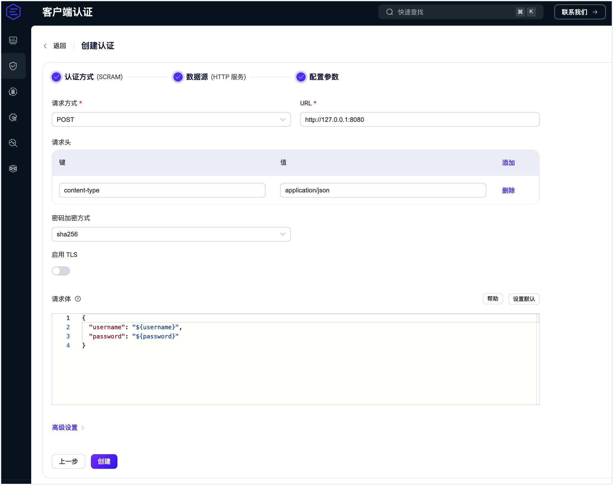

# 基于 REST API 的 MQTT 5.0 增强认证

EMQX 支持通过 REST API 实现的 MQTT 5.0 增强认证，采用了[加盐挑战响应认证机制（SCRAM）](https://en.wikipedia.org/wiki/Salted_Challenge_Response_Authentication_Mechanism)。在此实现中，SCRAM 认证器利用外部 Web 资源来获取所需的认证数据。当启用该认证器后，如果客户端通过 SCRAM 发起连接请求，EMQX 将使用提供的用户名构建一个 HTTP 请求，并发送至外部服务，从而获取认证过程中所需的认证数据。

虽然 SCRAM 本质上是一种轻量级且简单的认证机制，但此实现通过与外部 REST API 集成增强了其功能。这使得 EMQX 能够安全、高效地从各种外部系统获取认证数据，支持更复杂的认证场景。

::: tip 前提条件

- 熟悉 [EMQX 基本认证概念](./authn.md)。
- SCRAM 认证器仅支持 MQTT 5.0 连接。
- 此认证器并非对 RFC 7804 的实现：[加盐挑战响应 HTTP 认证机制](https://datatracker.ietf.org/doc/html/rfc7804)。

:::

## HTTP 请求和响应

基于 REST API 的 MQTT 5.0 增强认证过程类似于 HTTP API 调用。EMQX 作为客户端，构建并发送 HTTP 请求至外部 HTTP 服务。该服务根据 `username` 返回所需的认证数据。

### 响应格式要求

为了确保认证成功，HTTP 响应必须符合以下标准：

- **Content-Type**：响应必须编码为 `application/json`。
- **认证数据**：必须包含 `stored_key`、`server_key` 和 `salt`，这些字段均需使用十六进制编码。
- **超级用户标识**：使用 `is_superuser` 字段，值可以是 `true` 或 `false`。
- **客户端属性**：可选，您可以使用 `client_attrs` 字段指定[客户端属性](../../client-attributes/client-attributes.md)。键和值都必须为字符串。
- **权限列表 (ACL)**：可选，包含一个 `acl` 字段，以定义客户端的权限。详情参阅[权限列表](./jwt.md#权限列表)。
- **过期时间**：可选，您可以设置 `expire_at` 字段，以指定客户端认证的过期时间。过期后，客户端必须断开连接并重新认证。该值应为秒级 Unix 时间戳。
- **HTTP 状态码**：HTTP 响应应返回 `200 OK` 状态码。返回 `4xx` 或 `5xx` 状态码时，响应体将被忽略，认证链将继续进行，而不会使用此认证器。

### HTTP 响应示例

以下示例展示了期望的 HTTP 响应结构和内容：

```json
HTTP/1.1 200 OK
Headers: Content-Type: application/json
...
Body:
{
    "stored_key": "008F5E0CC6316BB172F511E93E4756EEA876B5B5125F1CD2FD69A2C30F9A0D73",
    "server_key": "81466E185EC642AFAE1EFA75953735D6C0934D099149AAAB601D59F8F8162580",
    "salt": "6633653634383437393466356532333165656435346432393464366165393137",
    "is_superuser": true, // 选项: true | false, 默认值: false
    "client_attrs": { // 可选
        "role": "admin",
        "sn": "10c61f1a1f47"
    },
    "expire_at": 1654254601, // 可选
    "acl": [ // 可选
        {
            "permission": "allow",
            "action": "subscribe",
            "topic": "eq t/1/#",
            "qos": [1]
        },
        {
            "permission": "deny",
            "action": "all",
            "topic": "t/3"
        }
    ]
}
```

## 在 Dashboard 中配置认证器

您可以通过 EMQX Dashboard 配置 SCRAM 认证器。

1. 登录 EMQX 控制台。

2. 在左侧导航菜单中，点击**访问控制** -> **认证**以打开**认证**页面。

3. 点击右上角的**创建**。

4. 选择 **SCRAM** 作为**认证方式**，选择 **HTTP 服务** 作为**数据源**。点击**下一步**进入**配置参数**步骤页面，如下图所示。

   

5. 配置以下设置：

   - **HTTP 配置**：

     - **请求方式**：选择 HTTP 请求方法（`GET` 或 `POST`）。

       ::: tip

       建议使用 `POST` 方法，以避免敏感信息（如密码）在服务器日志中暴露。在不受信任的环境中，请使用 HTTPS。

       :::

     - **URL**：输入 HTTP 服务的 URL 地址。

     - **请求头**（可选）：指定任何额外的 HTTP 请求头。

   - **认证配置**：

     - **密码加密方式**：选择密码哈希算法（`sha256` 或 `sha512`）。
     - **启用 TLS**：通过切换开关启用 TLS。有关启用 TLS 的更多信息，请参见[启用 TLS 加密访问外部资源](../../network/overview.md#启用-tls-加密访问外部资源)。
     - **请求体**：定义请求模板。对于 `POST` 请求，模板将作为 JSON 发送在请求体中；对于 `GET` 请求，模板将作为查询字符串编码在 URL 中。使用[占位符](./authn.md#认证占位符)来映射键和值。

   - **高级设置**：

     - **连接池大小**（可选）：设置从 EMQX 节点到 HTTP 服务器的并发连接数（整数值）。默认值：`8`。
     - **连接超时**（可选）：指定 EMQX 假定连接超时前的等待时间。支持的单位包括：`毫秒`、`秒`、`分钟`、`小时`。
     - **HTTP 管道**（可选）：输入一个正整数，以指定在等待响应之前可以发送的最大 HTTP 请求数。默认值：`100`。
     - **请求超时**（可选）：指定 EMQX 假定请求超时前的等待时间。支持的单位包括：`毫秒`、`秒`、`分钟`、`小时`。
     - **迭代次数**（可选）：设置 SCRAM 的迭代次数。默认值：`4096`。

6. 完成配置后，点击**创建**以最终确定设置。