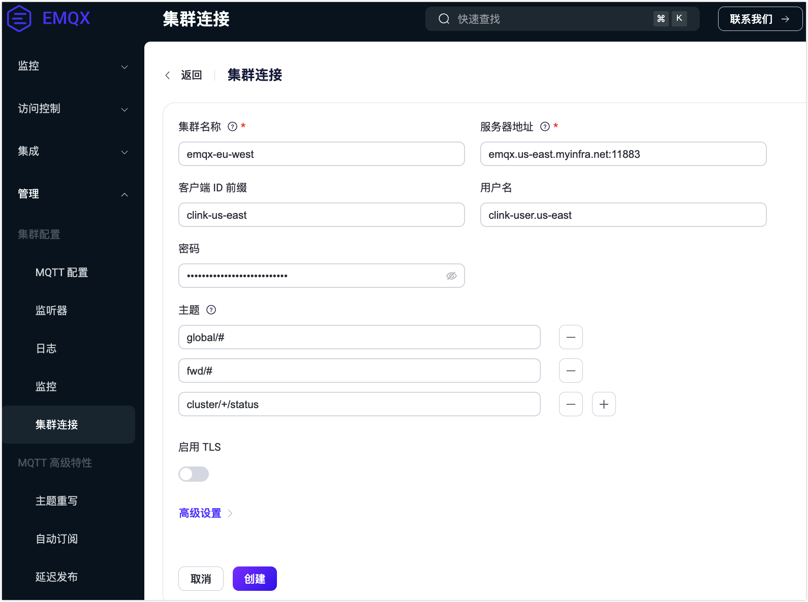

# 配置集群连接

本页面提供通过 EMQX Dashboard、配置文件，以及 REST API 来配置和管理集群连接功能的指南。

## 通过 Dashboard 配置和管理集群连接

登录 EMQX Dashboard，从左侧菜单中选择 **管理** -> **集群连接**。在**集群连接**页面，点击右上角的**创建**按钮开始配置新的集群连接。



在弹出的对话页面中设置以下字段：

- **集群名称**：输入远程集群的名称。
- **服务器地址**：提供远程集群的 MQTT 监听端点。
- **客户端 ID 前缀**：指定用于与远程集群的 MQTT 连接的客户端 ID 前缀。详见：[配置 MQTT 连接](#配置-mqtt-连接)。
- **用户名**：（可选）如有需要，输入连接到远程集群的认证用户名。
- **密码**：（可选）如有需要，输入连接到远程集群的认证密码。
- **主题**：列出 MQTT 主题过滤器的列表，指定本地集群将从远程集群接收的消息。详见：[配置主题](#配置主题)。
- **启用 TLS**：如果集群之间的通信需要 TLS 加密，请启用此选项。配置 SSL 证书等设置。
- **高级设置**：配置其他如 MQTT 协议参数的设置。

完成设置后，点击**创建**。

在集群连接页面中，您可以看到新创建的集群连接条目，默认为启用状态。集群连接列表显示了详细信息，例如集群名称、服务器地址、主题和启用状态。在**操作**列中，您可以通过点击**设置**或**删除**按钮来修改配置或删除条目。

点击集群名称将进入**概览**标签页，您可以在此监控消息传输统计数据以及集群连接的执行状态。要永久删除集群连接条目，请点击页面右上角的删除图标。或者，您可以通过切换开关暂时禁用集群连接，配置将会被保留以供将来使用。

## 通过配置文件配置集群连接

可以通过在 EMQX 配置中扩充 `cluster.links` 列表来设置集群之间的一个或多个连接。每个连接必须有唯一的远程集群名称，并且可以单独启用或禁用。

保持每个连接中的集群名称一致对于确保正确功能至关重要。在下面的示例中，远程集群名称应在其对应的配置文件中为 `emqx-eu-west`。

```bash
cluster {
  name = "emqx-us-east"
  links = [
    {
      name = "emqx-eu-west"
      server = "emqx.us-east.myinfra.net"
      username = "clink-user:us-east"
      password = "clink-password-no-one-knows"
      clientid = "clink-us-east"
      topics = ["global/#", "fwd/#", "cluster/+/status", ...]
      ssl {
        enable = true
        verify = verify_peer
        certfile = "etc/certs/client/emqx-us-east.pem"
        ...
      }
    }
    ...
  ]
}
```

确保远程 `emqx-eu-west` 集群在其配置文件中也有类似的连接配置到 `emqx-us-east`，以确保连接正常工作。

### 启用和禁用连接

配置的连接默认是启用的。可以通过将 `enable` 参数设置为 `false` 来禁用它。

禁用连接将阻止 EMQX 与远程集群通信。然而，这一操作并不会自动阻止远程集群与此集群通信，这可能会导致远程集群出现警告和报警。为避免这些问题，始终确保两边的连接都被禁用。

### 配置主题

`topics` 参数是一个 MQTT 主题过滤器列表，指定本地集群感兴趣的主题。本地集群期望从远程集群接收发布到这些主题的消息。这个列表可以为空，这意味着如果没有指定主题，本地集群将不会从远程集群接收任何消息。

### 配置 MQTT 连接

集群连接使用标准的 MQTT 作为底层协议，需要指定远程集群的 MQTT 监听端点为 `server`。

根据集群的大小和配置，可能会与远程集群建立多个 MQTT 客户端连接，每个客户端必须有唯一的 ClientID。可以通过设置 `clientid` 参数来控制这些 ClientID 的分配，该参数作为这些连接的 *ClientID 前缀*。

其他 MQTT 协议方面的参数，如认证和授权参数（`username`，`password`），也是可配置的。远程集群必须能够[认证](../access-control/authn/authn.md)这些连接，并[授权](../access-control/authz/authz.md)它们向集群连接设置指定的 MQTT 主题发布消息。例如，根据上述配置，远程集群可以有如下的 [ACL规则](../access-control/authz/file.md)来正常运行：

```erlang
%% 允许集群连接MQTT客户端操作"$LINK/#"主题
{allow, {clientid, {re, "^clink-us-east"}}, all, ["$LINK/#"]}.
...
```

此规则允许 ClientID 匹配正则表达式模式 `^clink-us-east` 的 MQTT 客户端发布和订阅任何以 `$LINK/` 开头的主题。`$LINK/` 是用于集群连接相关消息的控制主题前缀。这确保了订阅实体接收所有 `$LINK/` 命名空间下的相关消息，这些消息对于维护和管理集群连接是必要的。<!-- 这里需要解释一下 $LINK/#，这个是不是就是“控制主题”？帮助review这段描述是否正确-->

集群连接支持 TLS 连接。如果计划让集群通过公共互联网或任何其他不受信任的网络进行通信，TLS 是必须的。EMQX 还支持双向 TLS 认证，确保通信安全、保密和可信。

## 通过 REST API 管理集群连接

EMQX 的集群连接功能提供了一个 REST API，用于管理集群之间的连接，允许您执行配置任务和监控连接状态。该 API 提供了基本和高级操作，确保满足不同管理需求的灵活性。

### 基本 REST API 操作

对于更简单的用例，EMQX 支持使用以下端点进行基本的 REST API 操作：

- 配置集群连接：
  - **端点**: `PUT /cluster/links`
  - **功能**: 此操作允许您通过单个请求提供必要的配置参数来更新或创建新的集群连接。它适用于直接的热配置场景。
- 检索集群连接信息：
  - **端点**: `GET /cluster/links`
  - **功能**: 此操作返回所有现有集群连接的当前配置和状态，快速验证和查看集群之间活动连接。

### 高级 CRUD API 操作

为了更精细地控制集群连接，EMQX 支持使用以下 CRUD（创建、读取、更新、删除）操作：

| **操作**             | **端点**                       | **功能**                                                     |
| -------------------- | ------------------------------ | ------------------------------------------------------------ |
| **创建集群连接**     | `POST /cluster/links`          | 在集群之间建立新的连接，提供初始配置。                       |
| **检索特定集群连接** | `GET /cluster/links/{name}`    | 通过名称检索特定集群连接的详细信息。                         |
| **更新集群连接**     | `PUT /cluster/links/{name}`    | 修改现有集群连接的设置，允许您更新配置详细信息，例如主题、服务器地址或身份认证凭证。 |
| **删除集群连接**     | `DELETE /cluster/links/{name}` | 删除集群连接，终止指定集群之间的连接。                       |

### 监控集群连接状态和指标

除了配置任务之外，该 API 还提供了用于监控集群连接状态和性能的端点：

**检索集群连接状态**：

- **端点**: `GET /cluster/links` 或 `GET /cluster/links/{name}`

- **功能**: 返回所有集群连接或特定连接的状态。响应包括整体状态（“运行”、“停止”等）和详细的节点状态信息。

- **返回示例**：

  ```json
  {
    ...
    "server": "broker.emqx.io:1883",
    "topics": ["t/#"],
    "status": "running",
    "node_status": [
      {"node": "emqx@127.0.0.1", "status": "running"}
    ]
  }
  ```

**检索集群连接指标**：

- **端点**: `GET /cluster/links/{name}/metrics`

- **功能**: 提供与集群连接相关的度量，例如活动路由数（gauge 类型），可帮助您评估连接的当前负载和性能。

- **返回示例**：

  ```json
  {
    "metrics": {"routers": 10240},
    "node_metrics": [{}]
  }
  ```


**重置指定集群连接的指标**

- **端点**：`PUT /cluster/links/link/:name/metrics/reset`

- **功能**：允许您重置指定集群连接的所有累积指标。重置后，跟踪的该连接的性能统计数据将被清除并重新开始。这在进行配置更改后监控性能或用于故障排查时非常有用。

- **响应示例**：端点返回 `204`。

  

