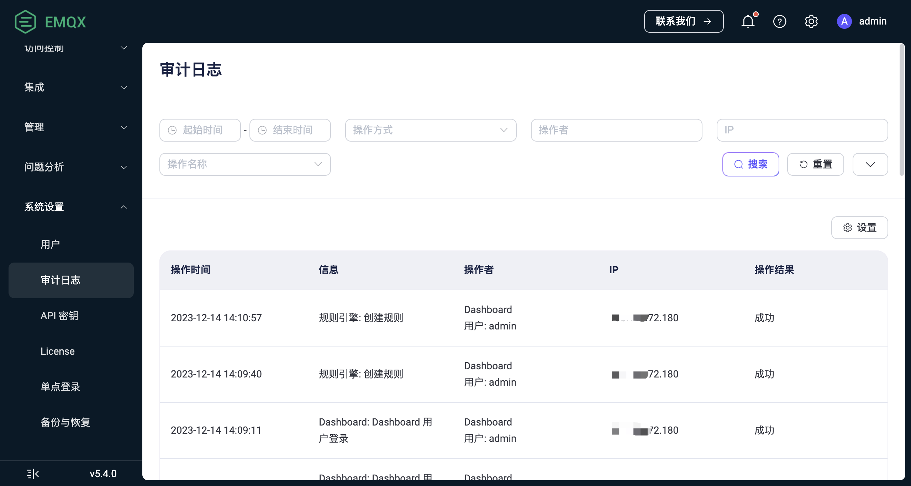

# 审计日志

审计日志（Audit Log）功能让您实时跟踪 EMQX 集群的重要操作变更，是企业用户遵守合规要求、确保数据安全的关键工具。

EMQX 审计日志支持记录来自 [Dashboard](../dashboard/introduction.md) 、[REST API](../admin/api.md) 以及 [CLI](../admin/cli.md) 和控制台的变更性操作，例如 Dashboard 用户登录，对客户端、访问控制以及数据集成等资源的修改。而指标获取、客户端列表查询等只读操作则不会被记录。

EMQX 提供了 Dashboard 查看以及日志系统集成的方式帮助企业管理审计日志。通过审计日志，企业用户可以方便地查看谁通过何种方式，在何时执行了哪些关键操作，以实现运营过程中的合规性和安全性审计。

## 启用审计日志

您可以通过 Dashboard 和配置文件启用审计日志并设置审计日志的配置参数。

### 通过 Dashboard 启用

Dashboard 上审计日志位于 **系统设置** -> **审计日志** 页面，您可以在该页面中启用并设置审计日志的配置参数。

初次进入该页面时，您需要单击 **启用** 按钮以启用审计日志。启用后，您可以点击右上角 **设置** 按钮配置审计日志的参数。

审计日志配置选项：


- **启用日志处理进程**：单击切换开关以启用或禁用审计日志处理进程。默认为禁用。
- **审计日志文件**：填写审计日志文件路径和名称。默认值为 `${EMQX_LOG_DIR}/audit.log`，其中 `${EMQX_LOG_DIR}` 是一个变量，默认为`./log`，意味着最终默认保存在 `./log/audit.log.1`  文件中。
- **最大日志文件数**：轮换的最大日志文件数。默认值为`10`。
- **日志文件轮换大小**：设置日志文件大小，达到设定的值时日志文件将进行轮换。如果禁用，则日志文件将无限增长。可在文本框输入设定的值，在下拉列表中选择单位，可选值为：`MB`, `GB`, `KB`。默认值为 `50MB`。
- **最大 Dashboard 记录数**：在数据库中存储的最大的记录数，该记录通过 Dashboard 和 /audit API 获取。
- **忽略高频请求**：忽略高频请求以避免淹没审计日志，例如发布/订阅、踢出客户端等请求。
- **时间偏移量**：定义日志中时间戳的格式。比如："-02:00" 或者 "+00:00"，默认为 `system`。

### 通过配置文件启用

您可以在 `emqx.conf` 文件中通过修改 `log.audit` 下的配置项启用审计日志并设置审计日志的配置参数，参见下面示例。

```bash
log.audit {
  enable = true
  path = "./log/audit.log"
  rotation_count = 10
  rotation_size = 50MB
  time_offset = system
}
```

## 查看审计日志

审计日志启用后，您可以在 Dashboard **系统设置** -> **审计日志** 页面中查看审计日志的内容。



### 搜索过滤

您可以对日志操作进行过滤搜索，支持的搜索关键字包括：

- **起始时间** - **结束时间**：操作发生的时间范围。
- **操作方式**：通过何种方式进行了操作，可选 `Dashboard`，`REST API`，`CLI` 以及`控制台`。此处的控制台是指 Erlang Shell 控制台，通常在 EMQ 提供现场技术支持服务时使用。
- **操作者**：Dashboard 用户名或者调用 REST API 的密钥名称。仅操作方式为 Dashboard 或 REST API 时有效。
- **IP**：Dashboard 用户或调用 REST API 的客户端来源 IP。仅操作方式为 Dashboard 或 REST API 时有效。
- **操作名称**：下拉选择审计日志支持记录的操作名称。
- **操作结果**：下拉选择`成功`或`失败`。

### 列表说明

以下是所显示的审计日志列表中每一列的说明：

- **操作时间**：操作发生的时间。
- **信息**：
  - 对于 Dashboard 或 REST API，这一列是操作名称。
  - 对于 CLI 与控制台，这一列记录了操作的命令。
- **操作者**：包括操作方式以及对应的操作者，当操作方式为 CLI 与控制台时，操作者为执行命令的 EMQX 节点名称。
- **IP**：Dashboard 用户或调用 REST API 的客户端来源 IP。仅操作方式为 Dashboard 或 REST API 时显示。
- **操作结果**：`成功`或`失败`，失败的情况包括表单校验不通过、资源无法删除。仅操作方式为 Dashboard 或 REST API 时显示，CLI 与控制台无法记录操作结果。

## 审计日志文件

审计日志启用后，操作记录将以日志文件的形式保存在 `./log/audit.log.1` 文件中，方便企业用户深入分析审计记录，并集成到现有的日志管理系统中，满足合规和数据安全需求。

::: warning 注意

命令行操作的审计日志可能包含敏感信息，在发送到日志收集器时需要谨慎操作。建议过滤日志内容或使用加密传输方式，避免未经授权的信息泄露。

:::

对于来自不同操作方式的操作记录，审计日志消息的格式中包含的字段有所不同。

### Dashboard 或 REST API 操作记录

记录来自 Dashboard 或 REST API 操作的审计日志包含操作用户、操作对象和操作结果等信息。日志消息格式示例如下：

```bash
{"time":1702604675872987,"level":"info","source_ip":"127.0.0.1","operation_type":"mqtt","operation_result":"success","http_status_code":204,"http_method":"delete","operation_id":"/mqtt/retainer/message/:topic","duration_ms":4,"auth_type":"jwt_token","query_string":{},"from":"dashboard","source":"admin","node":"emqx@127.0.0.1","http_request":{"method":"delete","headers":{"user-agent":"Mozilla/5.0 (Macintosh; Intel Mac OS X 10_15_7) AppleWebKit/537.36 (KHTML, like Gecko) Chrome/119.0.0.0 Safari/537.36","sec-fetch-site":"same-origin","sec-fetch-mode":"cors","sec-fetch-dest":"empty","sec-ch-ua-platform":"\"macOS\"","sec-ch-ua-mobile":"?0","sec-ch-ua":"\"Google Chrome\";v=\"119\", \"Chromium\";v=\"119\", \"Not?A_Brand\";v=\"24\"","referer":"http://localhost:18083/","origin":"http://localhost:18083","host":"localhost:18083","connection":"keep-alive","authorization":"******","accept-language":"zh-CN,zh;q=0.9,zh-TW;q=0.8,en;q=0.7","accept-encoding":"gzip, deflate, br","accept":"*/*"},"body":{},"bindings":{"topic":"$SYS/brokers/emqx@127.0.0.1/version"}}}
```

下面的表格中列出并解释了在以上日志示例中包含的字段：

| 字段名称         | 类型 | 描述                                                         |
| ---------------- | ---- | ------------------------------------------------------------ |
| time             | 整数 | 时间戳，表示日志记录的时间，以微秒为单位。                   |
| level            | 字符 | 日志级别。                                                   |
| source_ip        | 字符 | 操作来源 IP 地址。                                           |
| operation_type   | 字符 | 操作的功能模块，与 REST API 中的 Tag 对应。                  |
| operation_result | 字符 | 操作结果，"success", "failure" 分别表示操作成功或失败。      |
| http_status_code | 字符 | HTTP 响应状态码                                              |
| http_method      | 字符 | HTTP 请求方法                                                |
| duration_ms      | 整数 | 操作执行时间，以毫秒为单位。                                 |
| auth_type        | 字符 | 认证类型，表示用于身份验证的方法或机制，固定为 `jwt_token`(Dashboard) 或 `api_key`(REST API)。 |
| query_string     | 对象 | HTTP 请求中的 URL 查询参数。                                 |
| from             | 字符 | 请求来源，`dashboard`、`rest_api` 分别表示来自 Dashboard、REST API。当值为 `cli`, `erlang_console` 时表示来自 CLI 以及 Erlang Shell 的操作，不适用此日志结构。 |
| source           | 字符 | 执行操作的 Dashboard 用户名或 API 密钥名称。                 |
| node             | 字符 | 节点名称，表示执行操作的节点或服务器。                       |
| method           | 字符 | HTTP 请求方法，`post`, `put`, `delete` 对应创建、更新、删除操作。 |
| operate_id       | 字符 | 请求的 REST API 路径，请参考 [REST API](../admin/api.md)。   |
| bindings         | 对象 | 具体的请求对象信息，对应 `operate_id` 中的占位符。           |
| code             | 整数 | HTTP 响应码，表示操作的结果状态。                            |
| headers          | 对象 | HTTP 请求头信息，包括客户端标识、请求来源等。                |
| body             | 对象 | HTTP 请求体，包含操作的详细信息。                            |

### 命令行或 Erlang Console 操作记录

记录命令行或 Erlang Console 操作的审计日志包含执行的命令、调用参数等信息。日志消息格式示例如下：

```bash
{"time":1695866030977555,"level":"info","msg":"from_cli","from": "cli","node":"emqx@127.0.0.1","duration_ms":0,"cmd":"retainer","args":["clean", "t/1"]}
```

下面的表格中列出并解释了在以上日志示例中包含的字段：

| 字段名称    | 类型 | 描述                                                         |
| ----------- | ---- | ------------------------------------------------------------ |
| time        | 整数 | 时间戳，表示日志记录的时间，以微秒为单位。                   |
| level       | 字符 | 日志级别。                                                   |
| msg         | 字符 | 操作描述。                                                   |
| from         | 字符 | 请求来源，值为 `cli`, `erlang_console` 分别表示来自 CLI 以及 Erlang Shell 的操作。当值为 `dashboard`、`rest_api` 表示来自 Dashboard、REST API，不适用此日志结构。 |
| node        | 字符 | 节点名称，表示执行操作的节点或服务器。                       |
| duration_ms | 整数 | 操作执行时间，以毫秒为单位。                                 |
| cmd         | 字符 | 执行的具体命令操作，支持的命令请参考 [CLI](../admin/cli.md)。 |
| args        | 数组 | 命令附加的参数，多个参数使用数组分割。                       |
