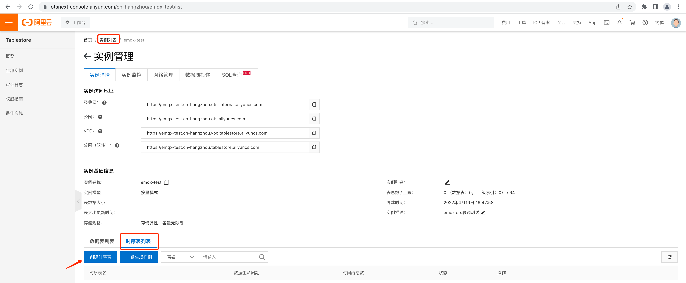
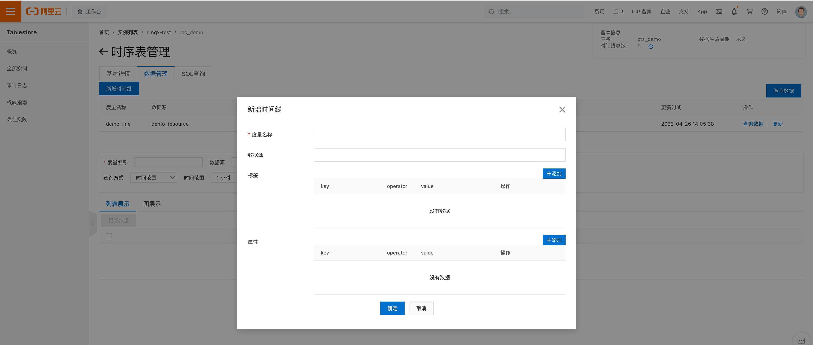
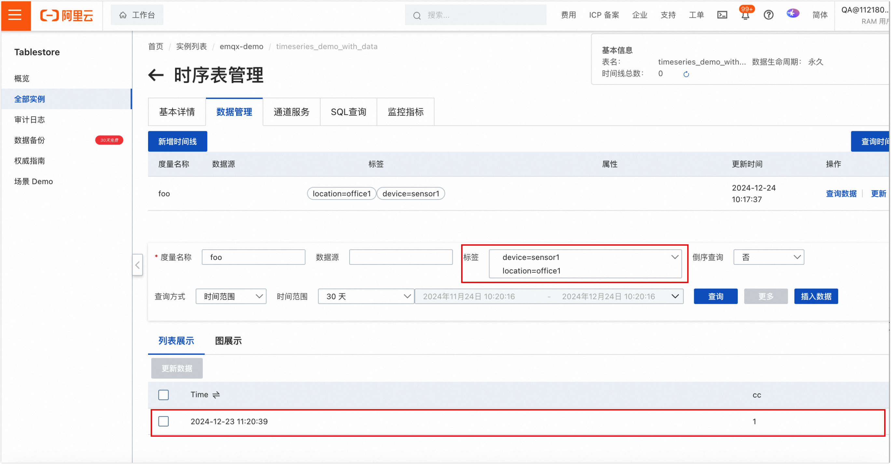

# 将 MQTT 数据写入到 Tablestore

::: tip

Tablestore 数据集成是 EMQX 企业版功能。

:::

[Tablestore](https://cn.aliyun.com/product/ots?from_alibabacloud=) 是一款可扩展的无服务器数据库，专为物联网场景优化。它提供了一种名为 IoTstore 的一站式解决方案，用于管理时序数据、结构化数据和半结构化数据。非常适用于物联网、车联网、风险控制、消息传递和推荐系统等场景。Tablestore 提供具有成本效益的高性能数据存储，支持毫秒级查询、检索，并具备灵活的数据分析能力。EMQX 与 Tablestore 云版、Tablestore OSS 和 Tablestore 企业版无缝集成，帮助实现物联网应用场景下的高效数据管理。

## 工作原理

EMQX 中的 Tablestore 数据集成将 EMQX 的实时数据捕获和传输能力与 Tablestore 的高性能数据存储和分析功能无缝结合。通过利用内置的[规则引擎](./rules.md)，该集成简化了将 EMQX 中的数据摄取并存储到 Tablestore 的过程，避免了复杂的编码工作。EMQX 通过其规则引擎和 Sink 将物联网设备数据转发到 Tablestore，实现高效存储和分析。

数据存储完成后，Tablestore 提供强大的分析工具，包括生成报告、图表和其他可视化的能力，用户可以通过 Tablestore 的可视化功能查看这些分析结果。

下图展示了储能场景中 EMQX 和 Tablestore 数据集成的典型架构。


EMQX 和 Tablestore 提供了一个可扩展的物联网平台，用于高效地实时收集和分析能耗数据。在此架构中，EMQX 作为物联网平台，负责设备接入、消息传输、数据路由等功能，Tablestore 作为数据存储和分析平台，负责数据存储、数据分析等功能。具体的工作流程如下：

1. **消息发布与接收**：储能设备通过 MQTT 协议连接成功后定期发布能耗数据，这些数据包括电量、输入输出功率信息。EMQX 接收到消息后将在规则引擎中进行比对。
2. **规则引擎处理消息**：通过内置的规则引擎，可以根据主题匹配处理特定来源的消息。当消息到达时，它会通过规则引擎，规则引擎会匹配对应的规则，并对消息数据进行处理，例如转换数据格式、过滤掉特定信息或使用上下文信息丰富消息。
3. **写入到 Tablestore**：规则引擎中定义的规则触发将消息写入到 Tablestore 的操作。Tablestore Sink 提供了 可配置的字段，能够灵活地定义写入的数据格式，将消息中的特定字段写入到 Tablestore 的对应的表和列中。

储能数据写入到 Tablestore 后，您可以对数据进行分析，例如：

- 连接到可视化工具，例如 Grafana，根据数据生成图表，展示储能数据。
- 连接业务系统，进行储能设备状态监控与告警。

## 特性与优势

Tablestore 数据集成具有以下特性与优势：

- **高效的数据处理能力**：EMQX 能够处理海量物联网设备连接与消息吞吐，Tablestore 在数据写入、存储和查询方面具有出色的性能表现，能够满足物联网场景下的数据处理需求，不会导致系统不堪重负。
- **消息转换**：消息可以写入 Tablestore 之前，通过 EMQX 规则中进行丰富的处理和转换。
- **可扩展性**：EMQX 与 Tablestore 都具备集群扩展能力，能够随着业务的发展，利用灵活地进行集群水平扩展，满足业务的发展需求。
- **丰富的查询能力**：Tablestore 提供包括优化的函数、运算符和索引技术，可实现对时间戳数据的高效查询和分析，准确地从 IoT 时间序列数据中提取有价值的见解。
- **高效存储**：Tablestore 使用高压缩比的编码方式，可以大幅降低存储成本。也可以自定义不同数据的存储时间,避免不必要的数据占用存储空间。

## 准备工作

本节介绍了在 EMQX 中创建 Tablestore Sink 之前需要完成的准备工作，包括创建数据库实例，创建时序表和管理时序表。

::: tip

EMQX 与 Tablestore 的数据集成目前仅支持时序模型。因此，以下步骤将专注于介绍时序模型的相关数据集成操作。

:::

### 前置准备

- 了解[规则](./rules.md)。
- 了解[数据集成](./data-bridges.md)。

### 创建时序表

1. 登录到 [Tablestore 控制台](https://account.alibabacloud.com/login/login.htm?spm=5176.12901015-2.0.0.1a364b84fgwsH6)。
2. 创建时序模型数据库实例。为实例提供一个名称，例如 `emqx-demo`。有关创建实例的详细说明，请参考 [Tablestore 官方文档](https://help.aliyun.com/zh/tablestore/getting-started/use-timeseries-model-in-tablestore-console?spm=a2c4g.11186623.help-menu-27278.d_1_2_0.6809619404X61r&scm=20140722.H_342856._.OR_help-T_cn~zh-V_1)。
3. 转到**实例管理**页面。
4. 在**实例详情**标签页中，选择**时序表列表**，并点击**创建时序表**按钮。
5. 配置时序表信息，为时序表提供一个名称，例如 `timeseries_demo_with_data`。点击**确定**。



### 管理时序表

要管理之前创建的时序表，请点击表格名称进入时序表管理界面。在那里，您可以根据业务需求执行以下操作：

1. 点击**数据管理**页签。

2. 点击**新增时间线**。

   ::: tip

   此步骤是可选的。如果时序列表尚未创建，Tablestore 在数据写入时会自动创建时间线。因此，本示例未演示手动添加时间线的步骤。

   :::



## 创建连接器

本节演示了如何创建一个用于将 Sink 连接到 Tablestore 服务器的连接器。

以下步骤假定 EMQX 与 Tablestore 均在本地运行，如您在远程运行 EMQX 及 Tablestore，请根据实际情况调整相应配置。

1. 进入 EMQX Dashboard，点击**集成** -> **连接器**。
2. 点击页面右上角的**创建**。
3. 在 **创建连接器**页面，点击选择 **Tablestore**，然后点击**下一步**。
4. 在**配置信息**步骤页中配置以下信息：

   - 输入连接器名称，名称应由字母和数字的组合组成。示例：`my_tablestore`。
   - 输入 Tablestore 服务器连接信息：
     - **端点**：输入您的 Tablestore 实例的访问地址。这应是托管您 Tablestore 服务的地址，您可以在 Tablestore 控制台的实例详情页面找到该地址。按照部署方式的不同，填写不同的域名。比如，公网地址为：`https://emqx-demo.cn-hangzhou.ots.aliyuncs.com`。
     - **实例名称**：要连接的 Tablestore 实例名称。在本示例中，使用之前创建的名称：`emqx-demo`。
     - **访问密钥 ID**：用于与 Tablestore 认证的 Access Key ID。此密钥由阿里云颁发，用于安全访问 Tablestore 资源。
     - **访问密钥**：与 Access Key ID 相关联的用于认证的 Access Key Secret。
     - **存储模型类型**：目前仅支持`时序`。
   - 配置 TLS 参数。Tablestore 使用 HTTPS 端点，故默认情况下 TLS 已经启用，并且无需配置 TLS 参数。有关 TLS 连接选项的详细信息，请参阅[启用 TLS 加密访问外部资源](../network/overview.md#启用-tls-加密访问外部资源)。
5. 在点击**创建**之前，您可以点击**测试连接**，以测试连接器是否能够连接到 Tablestore 服务器。
6. 点击最下方的**创建**按钮完成连接器的创建。在弹出对话框中，您可以点击 **返回连接器列表** 或点击 **创建规则** 继续创建规则和 Sink，以指定要转发到 Tablestore 的数据。具体步骤请参见[创建 Tablestore Sink 规则](#创建-tablestore-sink-规则)。

## 创建 Tablestore Sink 规则

本节演示了如何在 EMQX 中创建一条规则，用于处理来自源 MQTT 主题 `t/#` 的消息，并通过配置的 Sink 将处理后的结果发送到 Tablestore。

1. 点击 Dashboard 左侧导航菜单中的**数据集成** -> **规则**。

2. 在规则页面点击右上角的**创建**按钮。

3. 输入规则 ID `my_rule`。

4. 在 SQL 编辑器中输入规则，例如将 `t/#` 主题的 MQTT 消息存储至 Tablestore，可以输入以下 SQL 语句：

   ::: tip 注意

   如果您希望指定自己的 SQL 规则，必须确保规则选择出来的字段（SELECT 部分）包含之后在 Sink 中指定的 Tablestore 数据写入格式中包含的所有变量。

   :::

   ```sql
   SELECT
     *
   FROM
     "t/#"
   ```

   ::: tip

   如果您初次使用 SQL，可以点击 **SQL 示例**和**启用调试**来学习和测试规则 SQL 的结果。

   :::

5. 点击右侧的**添加动作**按钮，为规则在被触发的情况下指定一个动作。通过这个动作，EMQX 会将经规则处理的数据转发到 Tablestore。

6. 在**动作类型**下拉框中选择 `Alibaba 表格存储`，将**动作**下拉框保留为默认的`创建动作` 。您也可以选择一个之前已经创建好的 Tablestore Sink。本示例将创建一个新的 Sink。

7. 为 Sink 输入一个名称。名称应结合使用大写/小写字母和数字。

8. 从**连接器**下拉框中选择之前创建的 `my_tablestore`。您也可以通过点击下拉框旁边的按钮创建一个新的连接器。有关配置参数，请参见[创建连接器](#创建连接器)。

9. 配置以下字段：

   - **数据源**：EMQX 从中获取消息的数据源，表示正在处理的数据的来源。可以是特定的主题或数据流。

   - **表名**：数据将存储到 Tablestore 的表名。输入您之前创建的表名。您还可以使用变量（如 `${table}`）动态分配表名。

   - **度量名称**：在 Tablestore 中使用的度量名称，通常对应于数据的逻辑分组或类别。例如，它可以是类似 `temperature_readings` 或 `sensor_data` 的名称。 您还可以使用变量（如 `${measurement}`）动态分配度量名称。

   - **存储模型类型**：Tablestore 使用的数据存储模型类型。目前仅支持 `timeseries`，优化用于基于时间的数据。

   - **标签**：标签是与每个数据项关联的键值对，可以用来添加元数据或标签，以便更容易查询和过滤。您可以点击**添加**来定义多个标签，例如：

     | 键         | 值        |
     | ---------- | --------- |
     | `location` | `office1` |
     | `device`   | `sensor1` |

   - **字段**：字段列表，指定哪些数据将发送到 Tablestore。每个字段都映射到 Tablestore 表中的一列。您可以点击**添加**来添加以下内容：
     
     - **列**：Tablestore 中的列名。列名可以用变量。如 `${column_name}`。
     - **消息的值**：分配给列的值。该值可以是动态引用（如 `${value}`）、布尔值（`true`）、数字（`1.3`）或二进制数据。
     - **是否为整数**：如果列是数值类型，EMQX 默认按照浮点类型插入 Tablestore。如果想要插入整数值，需要将此标志设置为 `true`。若通过配置文件配置，可以使用变量（如：`${isint}`）动态分配。
     - **是否为二进制**：若该列为二进制，EMQX 默认按照字符串类型插入 Tablestore。如果想要插入二进制数据，需要此标志设置为 `true`。若通过配置文件配置，可以使用变量（如：`${isbinary}`）动态分配。
     
   - **时间戳**：Tablestore 中记录的时间戳，整数值，单位为微秒。表示要插入到 Tablestore 的时间戳。您可以指定一个固定值，或者填写 "NOW" 字符串来表示希望 EMQX 动态填入处理消息时的当前时间，也可以使用变量占位符（如 `${microsecond_timestamp}`) 动态分配。

   - **元数据更新模式**：定义 Tablestore 中元数据的更新策略：
     - `MUM_IGNORE`：忽略元数据更新，即使存在冲突更新，也确保元数据保持不变。
     - `MUM_NORMAL`：正常更新元数据，若元数据不存在，则在写入数据前动态创建元数据；若与现有元数据发生冲突，则可能会覆盖。

10. 展开**高级设置**，根据需要配置高级设置选项（可选），详细请参考[高级设置](#高级设置)。

11. 在点击**创建**之前，您可以点击**测试连接**，以测试 Sink 是否能够连接到 Tablestore 服务器。

12. 点击**创建**完成 Sink 的创建。回到**创建规则**页面，您将看到新的 Sink 出现在**动作输出**页签下。

13. 在**创建规则**页面，验证配置的信息。点击**创建**按钮生成规则。

现在您已成功创建规则，您可以在**规则**页面上看到新的规则。点击**动作(Sink)**标签，您可以看到新的 Tablestore Sink。

您还可以点击**集成** -> **Flow 设计器**查看拓扑。可以看到 `t/#` 主题的消息经过名为 `my_rule` 的规则处理，处理结果交由 Tablestore 进行存储。

## 测试规则

1. 使用 MQTTX 向 `t/1` 主题发布消息，此操作同时会触发上下线事件：

   ```bash
   mqttx pub -i emqx_c -t t/1 -m '{ "table": "timeseries_demo_with_data", "measurement": "foo", "microsecond_timestamp": 1734924039271024, "column_name": "cc", "value": 1}'
   ```

2. 分别查看两个 Sink 运行统计，命中、发送成功次数均 +1。

3. 前往 [Tablestore 控制台](https://account.alibabacloud.com/login/login.htm?spm=5176.12901015-2.0.0.1a364b84fgwsH6) 查看数据是否已经写入 Tablestore 中。输入度量名称（演示使用的是 `foo`），在**标签**中使用 `location=office1`, `device=sensor1` 作为查询条件，点击**查询**。

   

## 高级设置

本节将深入介绍可用于 Tablestore 连接器和 Sink 的高级配置选项。在 Dashboard 中配置连接器和 Sink 时，您可以根据您的特定需求展开**高级设置**，调整以下参数。

| 字段名称         | 描述                                                         | 默认值 |
| ---------------- | ------------------------------------------------------------ | ------ |
| 缓存池大小       | 指定缓冲区工作进程数量。这些工作进程将被分配用于管理 EMQX 与 Tablestore 的出口 （egress）类型 Sink 中的数据流，它们负责在将数据发送到目标服务之前临时存储和处理数据。此设置对于优化性能并确保出口（egress）场景中的数据传输顺利进行尤为重要。对于仅处理入口 （ingress）数据流的桥接，此选项可设置为 `0`，因为不适用。 | `16`   |
| 请求超期         | “请求 TTL”（生存时间）配置设置指定了请求在进入缓冲区后被视为有效的最长持续时间（以秒为单位）。此计时器从请求进入缓冲区时开始计时。如果请求在缓冲区内停留的时间超过了此 TTL 设置或者如果请求已发送但未能在 Tablestore 中及时收到响应或确认，则将视为请求已过期。 | `45`   |
| 健康检查间隔     | 指定 Sink 将对与 Tablestore 的连接执行自动健康检查的时间间隔（以秒为单位）。 | `15`   |
| 缓存队列最大长度 | 指定可以由 Tablestore Sink 中的每个缓冲区工作进程缓冲的最大字节数。缓冲区工作进程在将数据发送到 Tablestore 之前会临时存储数据，充当处理数据流的中介以更高效地处理数据流。根据系统性能和数据传输要求调整该值。 | `1`    |
| 批量请求大小     | 指定可以在单个传输操作中从 EMQX 发送到 Tablestore 的数据批处理的最大大小。通过调整此大小，您可以微调 EMQX 与 Tablestore 之间数据传输的效率和性能。 | `1`    |
| 请求模式         | 允许您选择`同步`或`异步`请求模式，以根据不同要求优化消息传输。在异步模式下，写入到 Tablestore 不会阻塞 MQTT 消息发布过程。但是，这可能导致客户端在它们到达 Tablestore 之前就收到了消息。 | `异步` |
| 请求飞行队列窗口 | “飞行队列请求”是指已启动但尚未收到响应或确认的查询。此设置控制 Sink 与 Tablestore 通信时可以同时存在的最大飞行队列请求数。<br/>当 **请求模式** 设置为 `异步` 时，“请求飞行队列窗口”参数变得特别重要。如果对于来自同一 MQTT 客户端的消息严格按顺序处理很重要，则应将此值设置为 `1`。 | `100`  |
