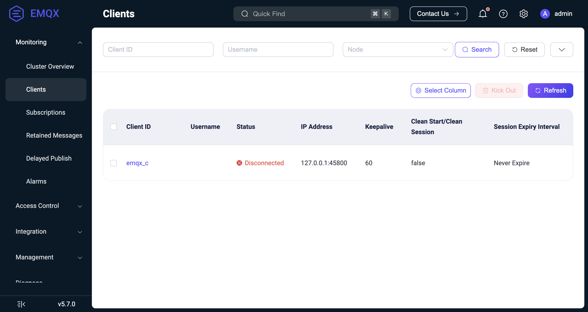
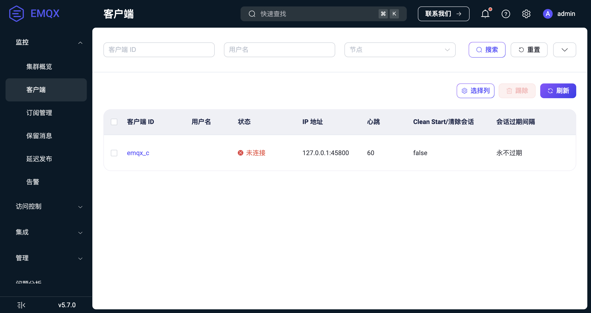
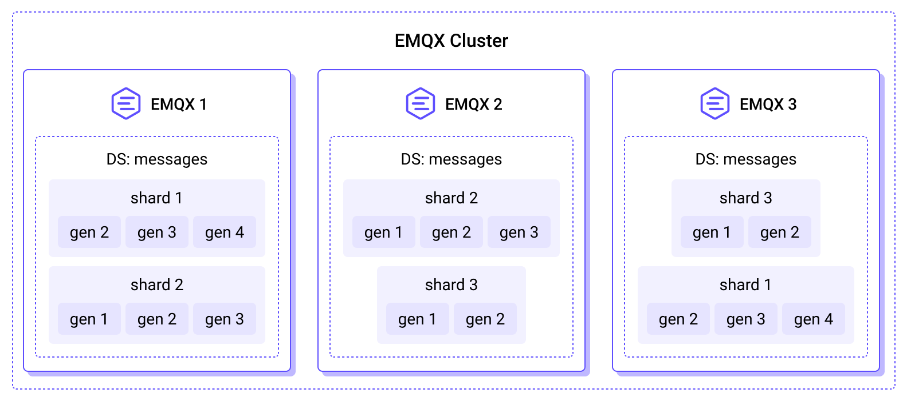

# MQTT 会话持久化

EMQX contains embedded durable storage for MQTT sessions.
This page gives a high-level introduction to the session durability feature in EMQX and how it ensures the resumption of sessions after the restart of EMQX nodes.

EMQX 内置了 MQTT 会话持久化（Durable Sessions）功能，可以将会话和消息持久化存储到磁盘，并提供高可用副本以保证数据的冗余和一致性。通过会话持久化功能，可以实现有效的故障转移和恢复机制，确保服务的连续性和可用性，从而提高系统的可靠性。

本页面介绍了 EMQX 中会话持久化的概念、原理和使用方法。

::: warning Important Notice
EMQX v5.7.0 does not support shared subscriptions for the durable sessions yet.
This feature will be implemented in a later release.
:::

::: warning 重要提示
该功能自 EMQX v5.7.0 版本起可用。然而，尚不支持共享订阅会话的持久化，计划在后续版本中实现。
:::

## 基本概念

在 MQTT 的使用场景中，持久会话（Persistent Sessions）和会话持久化（Durable Sessions）这两个概念可能容易引起混淆，因此本节将对这两个概念进行详细介绍。

- **持久会话（Persistent Sessions）**：MQTT 协议中的一个特性，当客户端与服务器建立连接时可以设置是否当前会话，这样，即使客户端断开连接再重新连接，它之前订阅的主题关系、为发送完成的消息等状态都会被保留。简而言之，它是关于客户端连接状态和消息队列的持久性保持。

- **会话持久化（Durable Sessions）**：与 MQTT 协议无关的特性，它指的是是否将客户端会话保存到持久存储（磁盘）中，保证消息传递的可靠性。

EMQX 的会话持久化功能只对持久会话生效，因此我们有必要先了解 [MQTT 会话](https://www.emqx.com/zh/blog/mqtt-session)的类型划分。

<!-- 
词汇表：
Broker -> 服务器 
Persistent -> 持久会话
Ephemeral -> 临时会话
-->

According to the MQTT standard, client sessions facilitate the management of client connections and states within the MQTT broker. Informally, EMQX separates client sessions into 2 logical categories:

- **Persistent**: Persistent sessions are kept by the broker after the client's connection terminates, and can be resumed if the client reconnects to the broker within the session expiry interval. Messages sent to the topics while the client was offline are delivered.

  持久会话主要有以下三个作用：

  1. 避免因网络中断导致需要反复订阅带来的额外开销。

  2. 避免错过离线期间的消息。

  3. 确保 QoS 1 和 QoS 2 的消息质量保证不被网络中断影响。

- **Ephemeral**: Ephemeral sessions exist only for the duration of the client's connection to EMQX. When a client with an ephemeral session disconnects, all session information, including subscriptions and undelivered messages, is discarded.

The client session is considered persistent in following cases:

- For the clients using the MQTT 5 protocol, [Session Expiry Interval](https://docs.oasis-open.org/mqtt/mqtt/v5.0/os/mqtt-v5.0-os.html#_Toc3901048) property of `CONNECT` or `DISCONNECT` packet is set to a value greater than zero.

- For the clients using MQTT 3.* protocol, [Clean Session](http://docs.oasis-open.org/mqtt/mqtt/v3.1.1/os/mqtt-v3.1.1-os.html#_Toc398718030) flag is set to 0, and `mqtt.session_expiry_interval` configuration parameter is set to a value greater than 0.

## 快速开始

本章节将帮助您快速了解如何在 EMQX 与 MQTT 客户端上使用会话持久化功能，并介绍简单的会话持久化工作流程。

**注意**：

即使没有启用持久会话，步骤 2-4 的操作仍然使用，即会话仍然会被保留、消息也将会保存在客户端队列中。

不同之处在于会话是否持久存储，以及步骤 5 中会话是否能在节点重启后恢复。

### 1. 在 EMQX 上启用会话持久化

默认情况下，EMQX 不启用会话持久化功能。您需要修改 `etc/emqx.conf` 文件并添加以下配置以启用该功能：

```bash
durable_sessions {
  enable = true
}
```

重启 EMQX 以应用配置。

### 2. 调整 MQTT 客户端连接参数以启用持久会话

以 MQTTX CLI 为例，它默认使用了 MQTT 5.0 协议，添加 `--no-clean` 选项以设置 `Clean Start = false`，同时指定客户端 ID 为 `emqx_c`，连接到 EMQX 并订阅 `t/1` 主题：

```bash
mqttx sub -t t/1 -i emqx_c --no-clean
```

### 3. 断开客户端连接，会话将被保留

断开步骤 2 中的客户端连接。打开 EMQX Dashboard，在 **监控** -> **客户端** 页面中，您仍然可以看到客户端状态变为**未连接**，这表明会话已经保留。

<!-- 英文截图： -->



### 4. 向客户端发送消息，消息将被发送到客户端队列

仍以 MQTTX CLI 为例，使用 `bench` 命令，通过 1 个客户端重复向 `t/1` 主题发布消息：

```bash
mqttx bench pub -t t/1 -c 1
```

根据 MQTT 协议要求，即使 `emqx_c` 客户端不在线，它订阅的 `t/1` 主题消息也会被保存在客户端队列中，以便在重新连接后继续派发。

### 5. 重启 EMQX 节点，会话与消息将从持久存储中恢复

重启 EMQX 节点，在没有进行任何客户端连接操作的情况下，打开 EMQX Dashboard，在 **监控** -> **客户端** 页面中可以看到状态为**未连接**的客户端，这表明会话已恢复。

尝试使用相同的客户端 ID `emqx_c`，并使用 `--no-clean` 选项设置 `Clean Start = false`）连接到 EMQX：

```bash
mqttx sub -t t/1 -i emqx_c --no-clean
```

离线期间接收到的消息将在此时将派发到当前客户端：

```bash
...
[2024-5-22] [16:14:14] › …  Connecting...
[2024-5-22] [16:14:14] › ✔  Connected
[2024-5-22] [16:14:14] › …  Subscribing to t/1...
[2024-5-22] [16:14:14] › ✔  Subscribed to t/1
[2024-5-22] [16:14:14] › payload: Hello From MQTTX CLI
...
```

**注意**：

- 必须使用相同的客户端 ID `emqx_c`，并指定 `--no-clean` 选项以将 `Clean Start` 设置为 `false`，确保满足这两项要求才能恢复持久的会话。
- 由于会话中已经保存了之前的订阅信息，即使重连时不重新订阅 `t/1` 主题，消息也会派发到客户端。

## How Durable Sessions Work

### 会话存储方式

EMQX offers 2 different storage implementations for client sessions, each optimized for specific use cases:

- **RAM**：使用节点所在服务器内存存储会话，会话是非持久的
- **Durable**：增加了持久层，在目前的版本中基于本地的 RocksDB + 节点本地磁盘存储会话

The implementation choice depends on the session type (persistent or ephemeral) and the `durable_sessions.enable` configuration parameter, which can be set globally or per [zone](../configuration/configuration.md#zone-override).

The implementation is selected based on the following criteria:

| `durable_sessions.enable` | Ephemeral | Persistent |
|------------------------------|-----------|------------|
| `false`                      | RAM       | RAM        |
| `true`                       | RAM       | durable   |

EMQX uses a unique approach to manage message durability, allowing RAM and durable sessions to coexist while minimizing storage costs.

When a durable session subscribes to a topic filter, EMQX marks topics matching the filter as "durable." This ensures that, aside from routing MQTT PUBLISH messages from these topics to RAM sessions, the broker also saves such messages to the durable storage.

Each durable MQTT message is stored exactly once on each replica, regardless of the number of subscribing durable sessions or their connection status. This efficient fan-out minimizes disk writes.

### Durable Storage Architecture

EMQX's durable storage is organized into a hierarchical structure comprising storages, shards, generations, and streams.



<!-- 
术语表：
标题上需要中英文对照：

Storage: 存储（Storage）
Shard: 分片（Shard）
Generation: 代 or 生成??（Generation） TODO 问一下 stone
Stream: 流（Stream）
 -->

#### Storage

Storage encapsulates all data of a certain type, such as MQTT messages or MQTT sessions.

#### Shard

Messages are segregated by client and stored in shards based on the publisher's client ID. The number of shards is determined by [n_shards](./managing-replication.md#number-of-shards) configuration parameter during the initial startup of EMQX. A shard is also a unit of replication. Each shard is consistently replicated the number of times specified by `durable_storage.messages.replication_factor` across different nodes, ensuring identical message sets in each replica.

#### Generation

Messages within a shard are segmented into generations corresponding to specific time frames. New messages are written to the current generation, while previous generations are read-only. Old generations are deleted based on the `durable_sessions.message_retention_period` parameter.

Generations can organize data differently according to the storage layout specification. Currently, only one layout is supported, optimized for high throughput of wildcard and single-topic subscriptions. Future updates will introduce layouts optimized for different workloads.

The storage layout for new generations is configured by the `durable_storage.messages.layout` parameter, with each layout engine defining its own configuration parameters.

#### Stream

Messages in each shard and generation are split into streams. Streams serve as units of message serialization in EMQX. Streams can contain messages from multiple topics. Various storage layouts can employ different strategies for mapping topics into streams.

Durable sessions fetch messages in batches from the streams, with batch size adjustable via the `durable_sessions.batch_size` parameter.

### Durable Session Across Cluster

Each node within an EMQX cluster is assigned a unique *Site ID*, which serves as a stable identifier, independent of the Erlang node name (`emqx@...`). Site IDs are persistent, and they are randomly generated at the first startup of the node. This stability maintains the integrity of the data, especially in scenarios where nodes might undergo name modifications or reconfigurations.

Administrators can manage and monitor durable sessions across the cluster by using the `emqx_ctl ds info` CLI command to view the status of different sites.

## 内存会话与持久存储对比

客户端会话的管理策略是确保服务稳定可靠的重要因素之一。本段落将对比分析 EMQX 中 MQTT 会话的内存存储与持久存储的特点，帮助开发者更好地理解各自的特性和适用场景，从而做出更加精准的部署决策。

### RAM Client Sessions

The RAM session implementation is the default and has been used in all EMQX releases before version 5.7. As the name implies, the state of RAM sessions is maintained entirely in volatile memory.

Advantages of RAM client sessions include:

- Very high throughput and low latency.
- Immediate message dispatch to clients.

However, there are some drawbacks:

- Session data is lost when the EMQX node hosting the session stops or restarts, due to the volatility of RAM.
- Undelivered messages are stored in a memory queue, with a limit to prevent memory exhaustion. New messages are discarded when this limit is reached, leading to potential message loss.

### Durable Client Sessions

Introduced in EMQX v5.7.0, the durable session implementation stores session state and messages routed to the durable sessions on disk.

Durable sessions provide robust durability and high availability by consistently replicating session metadata and MQTT messages across multiple nodes within an EMQX cluster. The configurable [replication factor](./managing-replication.md#replication-factor) determines the number of replicas for each message or session, enabling users to customize the balance between durability and performance to meet their specific requirements.

Advantages of durable client sessions include:

- Sessions can be resumed after EMQX nodes are restarted or stopped.
- MQTT messages are stored in a shared, replicated, durable storage instead of a memory queue, reducing RAM usage for both online and offline sessions.

However, there are some disadvantages:

- Storing messages on disk results in lower overall system throughput.
- Durable sessions have higher latency compared to RAM sessions because both writing and reading MQTT messages are performed in batches. While batching improves throughput, it also increases end-to-end latency (the delay before clients see the published messages).


## Hardware Requirements for 会话持久化

When 会话持久化 is enabled, EMQX saves the metadata of persistent sessions and MQTT messages sent to the persistent sessions on disk. Therefore, EMQX must be deployed on a server with sufficiently large storage capacity. To achieve the best throughput, it is recommended to use Solid State Drive (SSD) storage.

The storage requirements can be estimated according to the following guidelines:

- **Message Storage**: The space required for storing messages on each replica is proportional to the rate of incoming messages multiplied by the duration specified by the `durable_sessions.message_retention_period` parameter. This parameter dictates how long messages are retained, influencing the total storage needed.
- **Session Metadata Storage**: The amount of storage for session metadata is proportional to the number of sessions multiplied by the number of streams to which they are subscribed.
- **Stream Calculation**: The number of streams is proportional to the number of shards. It also depends (in a non-linear fashion) on the number of topics. EMQX automatically combines topics that have a similar structure into the same stream, ensuring that the number of streams doesn't grow too fast with the number of topics, minimizing the volume of metadata stored per session.


## Next Step

You can learn more about the durable session configuration and function operation and management through the following pages:

- [Configure and Manage Durable Storage](./management.md)
- [Manage Data Replication](./managing-replication.md)
