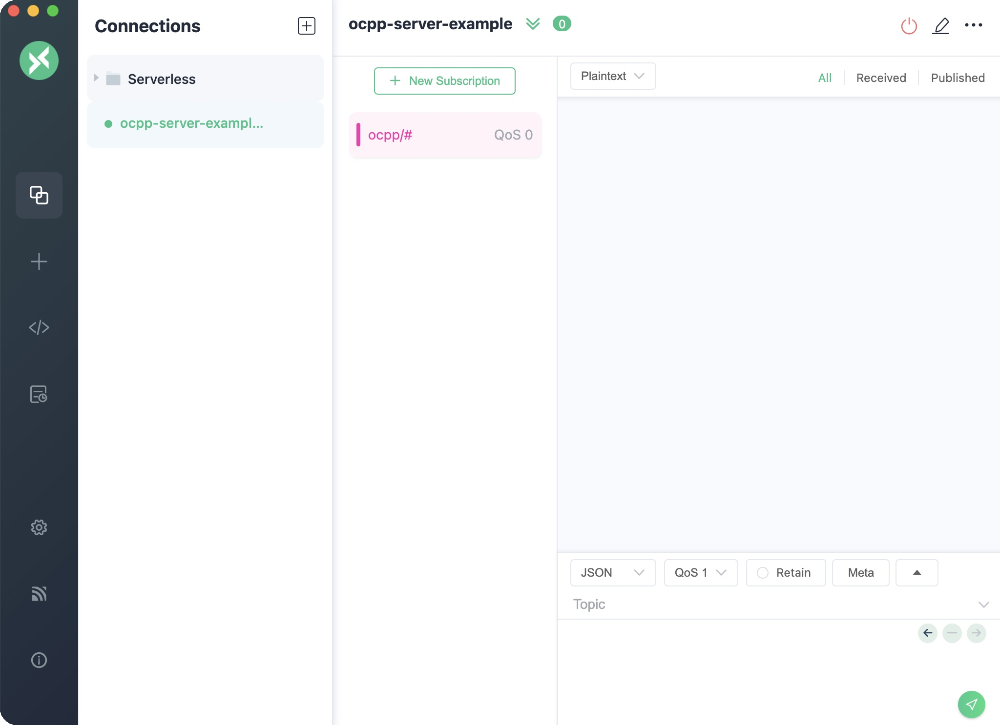

# OCPP 协议网关

::: tip

EMQX 企业版功能。EMQX 企业版可以为您带来更全面的关键业务场景覆盖、更丰富的数据集成支持，更高的生产级可靠性保证以及 24/7 的全球技术支持，欢迎[免费试用](https://www.emqx.com/zh/try?product=enterprise)。

:::

[OCPP](https://www.openchargealliance.org/) (Open Charge Point Protocol) 是一个连接充电桩与中央管理系统的开放通信协议，旨在为电动汽车充电基础设施提供统一的通信规范。OCPP 网关是一个消息协议转换器，它弥补了 OCPP 和 MQTT 协议之间的差距，因此使用这些协议的客户端能够相互通信。

EMQX 新增了 [OCPP 1.6-J](https://www.openchargealliance.org/protocols/ocpp-16/) 版本的协议网关，能够接入符合 OCPP 规范的各品牌充电桩设备，并通过规则引擎与数据集成、REST API 等方式与管理系统（Central System）集成，帮助用户快速构建电动汽车充电基础设施。

本页介绍了如何在 EMQX 中配置和使用 OCPP 网关。

## 启用 OCPP 网关

在 EMQX 中，可以通过 Dashboard、HTTP API 和 配置文件 `emqx.conf` 来启用 OCPP 网关。

以 Dashboard 为例，在 EMQX 仪表板上，点击左侧导航菜单中的 **管理** -> **网关**。在网关页面上，列出了所有支持的网关。找到 OCPP，点击配置。然后，您将被引导到初始化页面。

::: tip

如果您使用集群方式运行 EMQX，通过 Dashboard 或 HTTP API 进行的设置将会在整个集群范围生效。如果您只想更改一个节点的设置，请使用 [`emqx.conf`](../configuration/configuration.md) 进行配置。

:::

为了简化配置过程，EMQX 在网关页面上提供了所有必填字段的默认值。如果您不需要进行详细的自定义配置，只需要3次点击即可启用 OCPP 网关：

1. 在基本配置选项卡中点击 **下一步**，接受所有默认设置。
2. 然后您将被引导到监听器选项卡，在这里 EMQX 预先配置了一个 Websocket 监听器，端口为 33033。再次点击下一步确认设置。
3. 然后点击 **启用**按钮激活 OCP P网关。

完成网关激活过程后，您可以返回网关列表页面，观察到 OCPP 网关现在显示为已启用状态。


以上配置也可通过 REST API 完成。

**示例代码：**

```bash
curl -X 'PUT' 'http://127.0.0.1:18083/api/v5/gateways/ocpp' \
  -u <your-application-key>:<your-security-key> \
  -H 'Content-Type: application/json' \
  -d '{
  "name": "ocpp",
  "enable": true,
  "mountpoint": "ocpp/",
  "listeners": [
    {
      "type": "ws",
      "name": "default",
      "bind": "33033",
      "websocket": {
        "path": "/ocpp"
      }
    }
  ]
}'
```

## 测试 OCPP 客户端连接

一旦 OCPP 网关开始运行，您可以使用 OCPP 客户端工具进行连接测试并验证设置是否正确。

以 [ocpp-go](https://github.com/lorenzodonini/ocpp-go) 为实际例子，本节展示了如何将其连接到 EMQX 中的 OCPP 网关。

1. 首先准备一个 MQTT 客户端以与 OCPP 网关交互。例如，使用 [MQTTX](https://mqttx.app/downloads)，配置它连接到 EMQX 并订阅主题 `ocpp/#`。

   

2. 运行 ocpp-go 客户端并与 OCPP 网关建立连接。

   **注意**：请将下面命令中的 `<host>` 替换为您的 EMQX 服务器地址。

   ```shell
   docker run -e CLIENT_ID=chargePointSim -e CENTRAL_SYSTEM_URL=ws://<host>:33033/ocpp -it --rm --name charge-point ldonini/ocpp1.6-charge-point:latest
   ```

   成功连接后，将打印类似于以下的日志：

   ```css
   INFO[2023-12-01T03:08:39Z] connecting to server logger=websocket
   INFO[2023-12-01T03:08:39Z] connected to server as chargePointSim logger=websocket
   INFO[2023-12-01T03:08:39Z] connected to central system at ws://172.31.1.103:33033/ocpp
   INFO[2023-12-01T03:08:39Z] dispatched request 1200012677 to server logger=ocppj
   ```

3. 观察 MQTTX 收到的以下格式的消息：

   ```json
   Topic: ocpp/cp/chargePointSim
   {
     "UniqueId": "1200012677",
     "Payload": {
       "chargePointVendor": "vendor1",
       "chargePointModel": "model1"
     },
     "Action": "BootNotification"
   }
   ```

   此消息表明 ocpp-go 客户端已连接到 OCPP 网关并发起了 `BootNotification` 请求。

4. 在 MQTTX 中，编写以下内容的消息并发送到主题 `ocpp/cs/chargePointSim`。

   **注意**：确保将 `UniqueId` 替换为之前收到的消息中的 `UniqueId`。

   ```json
   {
     "MessageTypeId": 3,
     "UniqueId": "***",
     "Payload": {
       "currentTime": "2023-12-01T14:20:39+00:00",
       "interval": 300,
       "status": "Accepted"
     }
   }
   ```

5. 随后，MQTTX 将接收到 `StatusNotification` 状态报告。这表明 OCPP 客户端已成功与 OCPP 网关建立连接。

   ```json
   Topic: ocpp/cp/chargePointSim
   Payload:
   {
     "UniqueId": "3062609974",
     "Payload": {
       "status": "Available",
       "errorCode": "NoError",
       "connectorId": 0
     },
     "MessageTypeId": 2,
     "Action": "StatusNotification"
   }
   ```

## 自定义您的 ExProto 网关

除了默认设置外，EMQX 还提供了各种配置选项，以更好地适应您的特定业务需求。本节提供了关于**网关**页面上可用配置选项的深入概述。

### 基本配置

在 **基本配置** 标签页中，您可以设置允许的最大报文头长度、报文头长度，以及是否启用统计或为此网关设置 MountPoint 字符串。具体每个字段的详细说明，请参阅屏幕截图下方的文本。

<!--稍后将添加屏幕截图-->

- **默认心跳间隔**：默认的心跳时间间隔，默认为 `60s`。

- **心跳检测次数回退**：心跳检测次数的回退策略，默认为 `1`。

- **上行（Upstream）**：上传流配置组。

  - **主题（Topic）**：上传流呼叫请求消息的主题，默认为 `cp/${cid}`。
  - **topic_override_mapping**：根据消息名称重写上传流主题。
  - **回复主题（Reply Topic）**：上传流回复消息的主题，默认为 `cp/${cid}/Reply`。
  - **错误主题（Error Topic）**：上传流错误消息的主题，默认为 `cp/${cid}/Reply`。

- **下行（Dnstream）**：下载流配置组。

  - **主题（Topic）**：接收来自 EMQX 的请求/控制消息的下载流主题。该值为每个连接的充电点订阅的通配符主题名，默认为 `cs/${cid}`。
  - **max_mqueue_len**：下载流消息传递的最大消息队列长度，默认为 `100`。

- **消息格式检查**：是否启用消息格式合法性检查。EMQX 会根据 json-schema 定义的格式检查上传流和下载流的消息格式。当检查失败时，EMQX 将回复相应的答复消息。检查策略可以是以下值之一：

  - `all`：检查所有消息。
  - `upstream_only`：仅检查上传流消息。
  - `dnstream_only`：仅检查下载流消息。
  - `disable`：不检查任何消息。

- **Json Schema 目录**：OCPP 消息定义的 JSON Schema 目录，默认为 `${application}/priv/schemas`。

- **Json Schema ID 前缀**：OCPP 消息模式的 ID 前缀，默认为 `urn:OCPP:1.6:2019:12:`。

- **空闲超时时间**：设置网关等待 OCPP 帧的最大时间（以秒为单位），在因不活动而关闭连接之前，网关将等待此设定的时间。

- **启用统计**：设置是否允许网关收集和报告统计数据；默认为 `true`，可选值为 `true`、`false`。

- **挂载点**：设置一个字符串，该字符串作为所有主题的前缀，在发布或订阅时使用，提供了一种在不同协议之间实现消息路由隔离的方式，例如 *ocpp/*。

  **注意**：这个主题前缀由网关管理。客户端在发布和订阅时不需要显式添加此前缀。

### 添加监听器

名为 **default** 的 Websocket 监听器已在端口 `33033` 上配置，允许池中最多 16 个接收器，并支持多达 1,024,000 个并发连接。您可以点击 **设置** 进行更多自定义设置，点击 **删除** 来删除监听器，或点击 **+ 添加监听器** 来添加新的监听器。

::: tip

OCPP 网关仅支持 Websocket 和 TLS 上的 Websocket 类型监听器。

:::

点击 **添加监听器** 打开 **添加监听器** 页面，在此您可以继续进行以下配置字段：

**基本设置**

- **名称**：为监听器设置一个唯一标识符。
- **类型**：选择协议类型，对于 OCPP，可以是 `ws` 或 `wss`。
- **绑定**：设置监听器接受传入连接的端口号。
- **MountPoint**（可选）：设置一个字符串，该字符串作为所有主题的前缀，在发布或订阅时使用，提供了一种在不同协议之间实现消息路由隔离的方式。

**监听器设置**

- **路径**：设置连接地址的路径前缀。客户端必须携带整个地址进行连接，默认值 `/ocpp`。
- **接收器**：设置接收器池的大小，默认为 `16`。
- **最大连接数**：设置监听器可以处理的最大并发连接数，默认为 `1024000`。
- **最大连接率**：设置监听器每秒可以接受的新连接的最大速率，默认为 `1000`。
- **代理协议**：如果 EMQX 配置在[负载均衡器](../deploy/cluster/lb.md)后面，设置启用协议 V1/2。
- **代理协议超时**：设置网关等待代理协议包的最大时间（以秒为单位），在因不活动而关闭连接之前，网关将等待此设定的时间，默认为 `3s`。

**TCP 设置**

- **ActiveN**：设置套接字的 `{active, N}` 选项，即套接字可以主动处理的传入数据包的数量。详情参见 [Erlang 文档 - setopts/2](https://erlang.org/doc/man/inet.html#setopts-2)。
- **缓冲区**：设置用于存储传入和传出数据包的缓冲区大小，单位：KB。
- **TCP_NODELAY**：设置是否启用连接的 `TCP_NODELAY` 标志，即客户端是否需要等待前一数据的确认才能发送额外数据；默认为 `false`，可选值为 `true`、`false`。
- **SO_REUSEADDR**：设置是否允许本地重用端口号。
- **发送超时**：设置网关等待发送超时的最大时间（以秒为单位），默认为 `15s`。
- **发送超时**：设置是否在发送超时时关闭连接。

**SSL 设置**（仅适用于 SSL 监听器）

您可以通过设置开关来设置是否启用 TLS 验证。但在此之前，您需要配置相关的 **TLS 证书**、**TLS 密钥** 和 **CA 证书** 信息，可以通过输入文件内容或使用 **选择文件** 按钮上传。详情参见 [启用 SSL/TLS 连接](../network/emqx-mqtt-tls.md)。

然后，您可以继续设置：

- **SSL 版本**：设置支持的 SSL 版本，默认为 `tlsv1.3`、`tlsv1.2`、`tlsv1.1` 和 `tlsv1`。
- **如果无对等证书则拒绝**：设置如果客户端发送空证书时，EMQX 是否拒绝连接，默认为 `false`，可选值为 `true`、`false`。
- **中间证书深度**：设置可以包含在跟随对等证书的有效认证路径中的非自签发中间证书的最大数量，默认为 `10`。
- **密钥密码**：设置用户的密码，仅在私钥受密码保护时使用。

### 配置认证

由于用户名和密码的概念已在 OCPP 协议的连接消息中定义，OCPP 支持多种认证器类型，例如：

- [内置数据库认证](../access-control/authn/mnesia.md)
- [MySQL 认证](../access-control/authn/mysql.md)
- [MongoDB 认证](../access-control/authn/mongodb.md)
- [PostgreSQL 认证](../access-control/authn/postgresql.md)
- [Redis 认证](../access-control/authn/redis.md)
- [HTTP 服务器认证](../access-control/authn/http.md)
- [JWT 认证](../access-control/authn/jwt.md)

OCPP 网关使用 Websocket 握手消息中的基本认证信息来生成客户端的认证字段：

- 客户端 ID：连接地址固定路径前缀后部分的值。
- 用户名：基本认证中的用户名值。
- 密码：基本认证中的密码值。

您还可以使用 HTTP API 为 OCPP 网关创建内置数据库认证：

**示例代码：**

```bash
curl -X 'POST' \
  'http://127.0.0.1:18083/api/v5/gateway/ocpp/authentication' \
  -u <your-application-key>:<your-security-key> \
  -H 'accept: application/json' \
  -H 'Content-Type: application/json' \
  -d '{
  "backend": "built_in_database",
  "mechanism": "password_based",
  "password_hash_algorithm": {
    "name": "sha256",
    "salt_position": "suffix"
  },
  "user_id_type": "username"
}'
```

::: tip

与 MQTT 协议不同，**网关仅支持创建一个认证器，而不支持创建认证器列表（或认证链）**。

当没有启用任何认证器时，所有 OCPP 客户端都被允许登录。

:::
