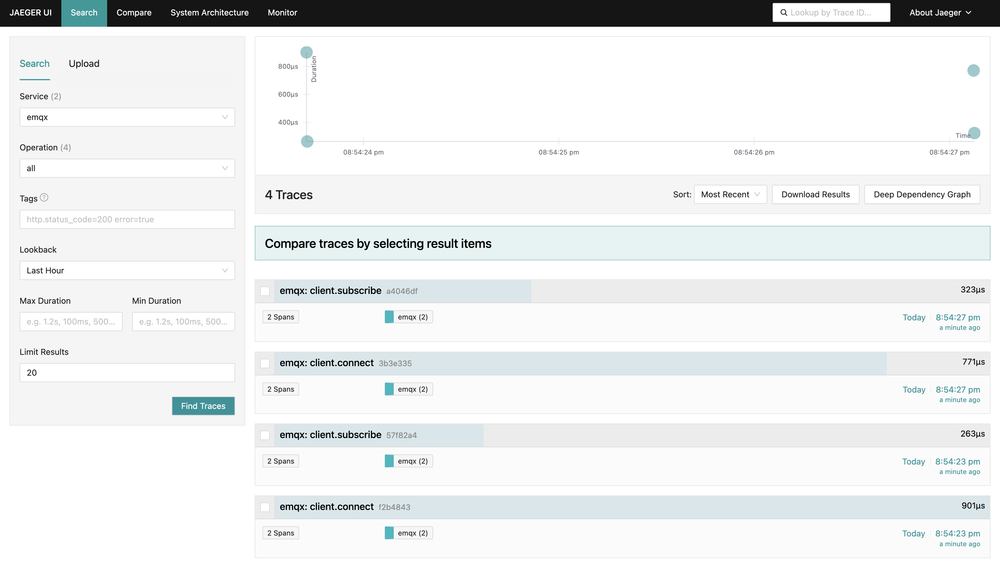

# 基于 OpenTelemetry 的 MQTT 端到端追踪

::: tip

仅 EMQX 5.8.3 及以上版本支持端到端追踪功能。

:::

在现代分布式系统中，跟踪请求流动和分析性能是确保系统可靠性和可观测性的关键。端到端追踪作为一种概念，旨在记录请求从起点到终点的完整路径，帮助用户深入了解系统的行为和性能表现。

从 EMQX 5.8.3 版本开始，EMQX 集成了基于 OpenTelemetry 的端到端追踪功能，特别适用于 MQTT 协议。通过该功能，用户可以清晰地跟踪消息的发布、路由和投递过程，尤其是在多节点集群环境中。这不仅有助于优化系统性能，还能快速定位故障并提升系统可靠性。

本页主要介绍如何在 EMQX 中启用端到端追踪功能，从而实现对 MQTT 消息的全链路可视化追踪。

## 设置 OpenTelemetry Collector

请参考[设置 OpenTelemetry Collector](./traces.md#设置-OpenTelemetry-Collector)。

## 在 EMQX 中启用端到端追踪

::: tip 提示

由于端到端追踪可能会影响系统性能，请仅在必要时启用该功能。

:::

本节指导您如何在 EMQX 中启用基于 OpenTelemetry 的端到端追踪。

### 通过 Dashboard 启用和配置端对端追踪

1. 点击 Dashboard 左侧菜单中的**管理** -> **监控**。
2. 选择页面中的**监控集成**选项卡。
3. 设置以下配置项：
   - **监控平台**：选择 `OpenTelemetry`。
   - **功能选择**：选择 `Traces`。
   - **服务地址**：设置追踪数据导出地址，默认为 `http://localhost:4317`。
   - **启用 TLS**：根据需要启用 TLS 加密通信，通常用于生产环境中的安全要求。
   - **追踪模式**：选择 `End-to-End` 以启用端到端追踪功能。
   - **集群标识符**：添加到跨度属性中的属性值，帮助识别数据是来自哪个 EMQX 集群。属性键将是 `cluster.id`。通常，设置一个简单且易于识别的名称或使用集群名称来标识不同的 EMQX 集群。默认为 `emqxcl`。
   - **追踪导出间隔**：设置追踪数据导出的时间间隔，默认为 `5` 秒。

4. 点击**追踪高级配置**，根据需要进行高级设置。参考[通过配置文件配置端对端追踪](#通过配置文件配置端对端追踪)中的配置示例。

   - **追踪配置**：用于设置其他追踪选项，包括是否追踪特定事件（如客户端连接、消息传输等）。

   - **客户端 ID 白名单**：设置一个白名单，以限制哪些客户端的连接或消息会被追踪。可以避免不必要的追踪以降低额外的系统资源消耗。

   - **主题白名单**：设置一个主题白名单，只有匹配的主题才能被追踪，类似于客户端白名单的作用，帮助控制追踪的范围。

5. 点击**确认**保存配置并关闭窗口。
6. 点击**保存更改**按钮以保存配置。

### 通过配置文件启用和配置端对端追踪

将以下配置添加到 EMQX `cluster.hocon` 文件中（假设 EMQX 在本地机器上运行）。

对于更多配置项含义及说明，您可以参考 [EMQX Dashboard 监控集成](http://localhost:18083/#/monitoring/integration)的 OpenTelemetry 子选项卡。

```bash
opentelemetry {
  exporter { endpoint = "http://localhost:4317" }
  traces {
   enable = true
   # 端到端追踪模式
   trace_mode = e2e
   # 端到端追踪选项
   e2e_tracing_options {
     ## 是否追踪客户端连接/断开事件
     client_connect_disconnect = true
     ## 是否追踪客户端消息事件
     client_messaging = true
     ## 是否追踪客户端订阅/取消订阅事件
     client_subscribe_unsubscribe = true
     ## 客户端ID 白名单最大长度
     clientid_match_rules_max = 30
     ## 主题过滤器白名单最大长度
     topic_match_rules_max = 30
     ## 集群标识符
     cluster_identifier = emqxcl
     ## 消息追踪等级（QoS）
     msg_trace_level = 2
     ## 采样率，即除白名单以外追踪事件的采样率
     ## Note: 仅当追踪事件开启时才根据采样率进行采样
     sample_ratio = "100%"
    }
  }
  max_queue_size = 50000
  scheduled_delay = 1000
 }
}
```

## 端对端追踪使用示例

启用端到端追踪后，您可以按照以下步骤演示多节点设置中的 MQTT 分布式追踪功能。

1. 启动 EMQX 节点，例如，以节点名 `emqx@172.19.0.2` 和 `emqx@172.19.0.3` 启动一个有两个节点的集群，以展示分布式追踪功能。

2. 使用 [MQTTX CLI](https://mqttx.app/zh/cli) 作为客户端在不同节点上订阅相同主题。

   - 在 `emqx@172.19.0.2` 节点上订阅：

     ```bash
     mqttx sub -t t/1 -h 172.19.0.2 -p 1883
     ```

   - 在 `emqx@172.19.0.3` 节点上订阅：

     ```bash
     mqttx sub -t t/1 -h 172.19.0.3 -p 1883
     ```

3. 大约 5 秒后（EMQX 导出追踪数据的默认间隔），导航到 [http://localhost:16686](http://localhost:16686/) 的 Jaeger WEB UI 观察追踪数据：

   选择 `emqx` 服务并点击**查找追踪**。如果 `emqx` 服务没有立即出现，请稍等片刻后刷新页面。您应该看到客户端连接及订阅的事件追踪：

   

4. 发布任意消息：

     ```bash
     mqttx pub -t t/1 -h 172.19.0.2 -p 1883
     ```

5. 等待片刻，您可以在 Jaeger WEB UI 找到 MQTT 消息的详细追踪：

   点击追踪查看详细的跨度信息和追踪时间线，视订阅者多寡、消息路由是否需要跨节点、消息 QoS 、`msg_trace_level` 等配置的不同，一条 MQTT 消息在追踪时间线中可能会具有不等数量的跨度信息。

   以下是在两个客户端均具有 QoS2 级别订阅，消息发布者发布 QoS2 等级的 MQTT 消息，及 `msg_trace_level` 配置为 2 时的追踪时间线及跨度信息。

   特别地，由于客户端 `mqttx_9137a6bb` 与消息发布者连接在不同的 EMQX 节点。在消息向该客户端投递时需要跨节点传输，所以具有两个额外的跨度：`message.forward` 与 `message.handle_forward`。

   

## 管理追踪跨度过载

EMQX 会积累追踪跨度，并定期批量导出它们。 导出间隔由 `opentelemetry.trace.scheduled_delay` 参数控制，默认为 5 秒。 批处理追踪跨度处理器包含过载保护机制，允许只积累到一定限制的跨度，该限制默认为 2048 个跨度。您可以使用以下配置设置此限制：

```yaml
opentelemetry {
  traces {
    max_queue_size = 50000
    scheduled_delay = 1000
  }
}
```

一旦达到 `max_queue_size` 限制，新的追踪跨度将被丢弃，直到当前队列被导出。

::: tip 提示

如果追踪的消息被分发给大量订阅者，或由于消息数量多，采样率较高等因素，预计只有少量跨度会被导出，大多数跨度会因过载保护而被丢弃。

对于端到端追踪模式，应视消息量及采样率增加 `max_queue_size` 值，于此同时也可适当减小 `scheduled_delay` 配置以增加跨度导出频率。从而避免端到端追踪的跨度因过载保护而丢失。

**但需要注意的是，较高的导出频率与较大的导出队列长度，可能会增加系统的资源消耗。您应在启用该功能前，对消息 TPS 、系统可用资源等受限因素进行适当估计以采取合适的配置。**

:::
